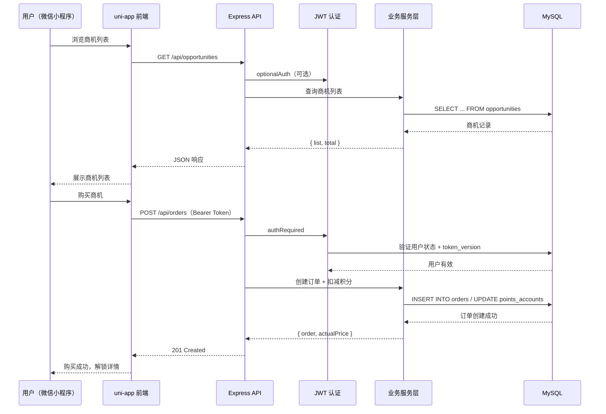
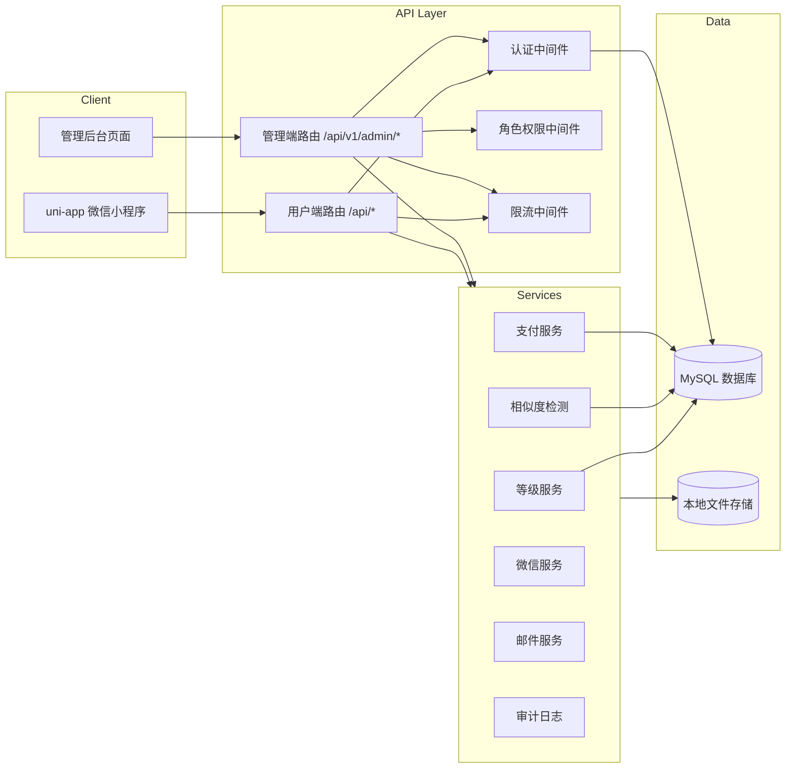

# 系统架构文档

## 概述

Hotel Opportunity Follow（HOF）是一个酒店行业商机互助平台小程序。酒店供应商（装修总包、弱电总包、软装总包、家具、设备等）可以在此发布、采购、跟进酒店项目商机，并通过匿名同步进展的方式，帮助同一条商机的购买者了解真实推进情况，降低信息不对称。

平台核心流程：用户注册 → 浏览/搜索商机 → 购买解锁详情 → 录入 CRM 跟进 → 匿名同步进展 → 其他购买者参考进展并点赞/举报 → 通过积分与信用分体系激励优质内容。

系统采用前后端分离架构：前端为 uni-app 微信小程序（Vue 3 + Vite + Pinia），后端为 Express + MySQL，管理后台与用户端共用同一套前端工程，通过路由区分。

## 技术栈

**语言与运行时**
- 前端：JavaScript（ES2020+），Vue 3 Composition API
- 后端：Node.js 20+，Express 4
- 数据库：MySQL 8.0

**框架**
- 前端框架：uni-app（Vue 3 + Vite + Pinia）
- 后端框架：Express + 自定义中间件
- 认证：JWT（用户端 7 天 / Refresh Token 30 天；管理端独立密钥）

**数据存储**
- 主数据库：MySQL（mysql2/promise 连接池，上限 10）
- 文件存储：本地文件系统（/workspace/uploads）

**基础设施**
- 部署：Docker（node:20-alpine），单容器部署
- 限流：自定义内存限流中间件（API 默认 60s/300 次，登录 60s/10 次）
- 安全：账号登录失败锁定（900s 窗口，5 次失败锁定）

**外部服务**
- 微信小程序：微信登录、手机号解密、JSAPI 支付（预留）
- 支付渠道：Mock / 微信支付 / 支付宝 / Stripe / Waffo Pancake
- 邮件：SMTP（开发环境打印日志，生产环境真实发送）

## 项目结构

```
/workspace/
├── miniapp/                    # uni-app 前端工程（微信小程序 + H5）
│   ├── src/
│   │   ├── api/                # API 层
│   │   │   ├── index.js        # 用户端 API 方法
│   │   │   └── adminApi.js     # 管理后台 API 方法
│   │   ├── common/             # 公共工具
│   │   │   ├── request.js      # 统一请求层（token 刷新、重试）
│   │   │   ├── constants.js    # 业务常量与工具函数
│   │   │   ├── config.js       # 环境配置
│   │   │   ├── storage.js      # 本地存储封装
│   │   │   └── payment.js      # 支付相关
│   │   ├── components/         # 全局组件
│   │   │   ├── CustomTabBar.vue
│   │   │   ├── MarketIntelligence.vue
│   │   │   ├── ConfirmDialog.vue
│   │   │   ├── Pagination.vue
│   │   │   ├── StateView.vue
│   │   │   └── SearchBar.vue
│   │   ├── pages/              # 页面（28 用户端 + 20 管理后台）
│   │   │   ├── index/          # 首页
│   │   │   ├── hall/           # 互助大厅
│   │   │   ├── opportunity/    # 商机详情/发布/我的发布
│   │   │   ├── crm/            # CRM 客户管理
│   │   │   ├── followup/       # 进展同步
│   │   │   ├── community/      # 社区功能（通知/提醒/等级/信用/邀请/排行）
│   │   │   ├── profile/        # 个人中心
│   │   │   ├── order/          # 订单
│   │   │   ├── points/         # 积分
│   │   │   ├── common/         # 公共页（协议/公告/帮助）
│   │   │   ├── login/          # 登录注册
│   │   │   └── admin/          # 管理后台
│   │   ├── store/              # Pinia 状态管理
│   │   │   └── user.js         # 用户状态
│   │   ├── App.vue             # 应用入口与全局样式
│   │   ├── main.js             # Vue + Pinia 初始化
│   │   └── pages.json          # 路由与 tabBar 配置
│   ├── test/                   # 单元测试（vitest）
│   ├── vite.config.js          # Vite 配置
│   └── manifest.json           # 小程序配置
│
├── server/                     # Express 后端服务
│   ├── index.js                # 入口：初始化 DB、迁移、种子、启动服务
│   ├── config.js               # 环境变量与全局配置
│   ├── db.js                   # MySQL 连接池与查询工具
│   ├── constants.js            # 业务常量
│   ├── auth.js                 # JWT 签发/验证/中间件
│   ├── middleware/             # 中间件
│   │   ├── rate-limit.js       # 限流
│   │   ├── require-role.js     # 角色权限
│   │   └── cache-headers.js    # 缓存头
│   ├── routes/                 # 路由（用户端 16 + 管理后台 18）
│   │   ├── auth.routes.js
│   │   ├── opportunity.routes.js
│   │   ├── order.routes.js
│   │   ├── points.routes.js
│   │   ├── follow-up.routes.js
│   │   ├── crm.routes.js
│   │   ├── reminders.routes.js
│   │   ├── notification.routes.js
│   │   ├── credits.routes.js
│   │   ├── rankings.routes.js
│   │   ├── banner.routes.js
│   │   ├── announcements.routes.js
│   │   └── admin/              # 管理后台路由
│   ├── services/               # 业务服务层
│   │   ├── account-lock.service.js
│   │   ├── audit-log.service.js
│   │   ├── level.service.js
│   │   ├── mail.service.js
│   │   ├── similarity.service.js
│   │   ├── wechat.service.js
│   │   ├── file-magic.js
│   │   └── payment/            # 支付适配器
│   ├── migrations/             # 数据库迁移（16 步）
│   ├── seeds/                  # 种子数据
│   │   └── seed.js
│   ├── scheduler.js            # 定时任务调度器
│   ├── test/                   # 后端测试
│   ├── Dockerfile              # 容器镜像
│   └── .env.example            # 环境变量模板
│
└── .monkeycode/                # 项目文档与记忆
```

**入口点**
- `miniapp/src/main.js`：Vue 3 + Pinia 初始化，加载登录态
- `server/index.js`：数据库初始化 → 迁移 → 种子数据 → 启动 HTTP 服务 → 启动定时任务

## 子系统

### 前端小程序（miniapp/）
**目的**：酒店供应商用户端 + 管理后台的 uni-app 微信小程序实现  
**位置**：`miniapp/`  
**关键文件**：
- `src/pages.json`：28 个用户端页面 + 20 个管理后台页面的路由配置，5 个 tabBar
- `src/api/index.js`：30+ 用户端 API 方法，统一请求层处理 token 刷新与重试
- `src/components/MarketIntelligence.vue`：同行进展展示组件（匿名购买者进展列表、点赞、举报）
- `src/common/request.js`：请求拦截器，401 自动 refresh，GET 异常自动重试

**依赖**：Express API（/api/*）、微信小程序 SDK

### 后端服务（server/）
**目的**：提供 RESTful API、认证授权、业务逻辑、数据持久化  
**位置**：`server/`  
**关键文件**：
- `server/routes/`：34 个路由文件，覆盖用户端 16 个业务模块 + 管理后台 18 个模块
- `server/services/level.service.js`：会员等级计算引擎（购买率/无效率/有用率/活跃度）
- `server/services/similarity.service.js`：商机相似度检测（TF 余弦 + 编辑距离）
- `server/middleware/rate-limit.js`：API 限流 + 登录限流
- `server/scheduler.js`：24h 定时任务（等级重算、积分清理、通知清理）

**依赖**：MySQL 数据库、微信 API（openid/手机号/支付）、邮件 SMTP

### 数据层（db/）
**目的**：MySQL 数据持久化，16 步幂等迁移，支持从零初始化  
**位置**：`server/db.js` + `server/migrations/` + `server/seeds/`  
**关键表**：users（用户）、opportunities（商机）、orders（订单）、points_accounts（积分）、crm_opportunities（CRM）、follow_ups（跟进）、follow_up_shares（进展同步）、user_level_stats（等级统计）、user_credits（信用分）、notifications（通知）

**依赖**：MySQL 8.0

### 管理后台（admin/）
**目的**：运营/财务/超管后台，管理商机、用户、审核、财务、系统配置  
**位置**：`miniapp/src/pages/admin/`（前端） + `server/routes/admin/`（后端）  
**关键文件**：
- 前端 20 个管理页面，独立 API 层 `adminApi.js`（ADMIN_SECRET 认证）
- 后端 18 个管理路由，`adminAuthRequired` + `requireRole` 双重权限校验
- 4 个预置角色：super_admin / operation / finance / support

**依赖**：用户端后端 API（部分数据查询复用）

## 数据流



## 架构图


