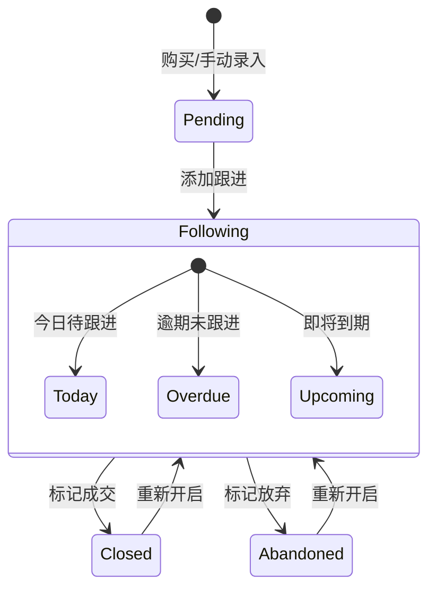

# CRM 商机

CRM 商机是用户（购买者）将已购买的商机录入个人客户管理系统的记录，用于跟进管理、记录跟进历史，并可将跟进进展匿名同步到商机详情页供其他购买者参考。

## 什么是 CRM 商机？

当用户购买一条商机后，该商机会自动进入用户的 CRM 库（source = purchased）。用户也可以手动录入商机到 CRM（source = manual）。在 CRM 中，用户可以为每条商机添加跟进记录（电话沟通、加微信、意向确认、报价、谈判、成交、放弃等状态），并设置下次跟进日期。系统根据 next_follow_date 自动计算今日待跟进、逾期未跟进、即将到期等提醒。

**关键特征**：
- 双来源：purchased（购买获得）/ manual（手动录入）
- 跟进记录私有：仅创建者可见
- 状态流转：pending（待首次跟进）/ following（跟进中）/ closed（成交）/ abandoned（放弃）
- 智能提醒：按 next_follow_date 自动分类今日/逾期/即将到期
- 进展同步：可将跟进记录匿名同步到商机详情页的「同行进展」板块

## 代码位置

| 方面 | 位置 |
|------|------|
| 数据库表 | `crm_opportunities`、`follow_ups`、`follow_up_shares`、`follow_up_helpful_marks`、`follow_up_share_invalid_marks` |
| 后端路由 | `server/routes/crm.routes.js`、`server/routes/follow-up.routes.js` |
| 前端页面 | `miniapp/src/pages/crm/detail.vue`、`miniapp/src/pages/crm/index.vue`、`miniapp/src/pages/followup/share.vue` |
| API 方法 | `miniapp/src/api/index.js` 中的 `crmList`、`crmDetail`、`crmAdd`、`crmPublish`、`followUps`、`addFollowUp`、`shareFollowUp` |

## 关键字段

### crm_opportunities

| 字段 | 类型 | 描述 |
|------|------|------|
| `id` | INT | 唯一标识 |
| `user_id` | INT | 所属用户 |
| `opportunity_id` | INT | 关联商机 ID（purchased 时有值） |
| `source` | ENUM | purchased / manual |
| `status` | ENUM | pending / following / closed / abandoned |

### follow_ups

| 字段 | 类型 | 描述 |
|------|------|------|
| `id` | INT | 唯一标识 |
| `crm_opportunity_id` | INT | 所属 CRM 商机 |
| `user_id` | INT | 创建者 |
| `status` | ENUM | 跟进状态（call_no_answer / added_wechat / interested / quoting / negotiating / closed / abandoned） |
| `content_private` | TEXT | 跟进内容（私有） |
| `next_follow_date` | DATE | 下次跟进日期 |

### follow_up_shares

| 字段 | 类型 | 描述 |
|------|------|------|
| `id` | INT | 唯一标识 |
| `user_id` | INT | 同步者（全匿名） |
| `opportunity_id` | INT | 关联商机 |
| `follow_up_id` | INT | 来源跟进记录 ID |
| `status` | ENUM | 同步的跟进状态 |
| `summary` | TEXT | 进展摘要（匿名） |
| `helpful_count` | INT | 有用计数 |
| `report_count` | INT | 举报计数 |
| `audit_status` | ENUM | pending / approved / rejected |
| `is_anonymous` | TINYINT | 固定 1（全匿名） |

## 生命周期

## 进展同步机制

1. 用户在 CRM 详情点击「同步进展」，选择跟进记录一键同步或手动填写
2. 系统验证用户是否购买过该商机（`orders` 表 status = paid）
3. 根据用户等级判断是否免审：high 等级自动 approved，否则 pending
4. 审核通过后展示在商机详情的「同行进展」板块
5. 其他购买者可以点赞（+1 积分/信用分）或举报（达阈值自动下架）
6. 同步者获得奖励积分（审核通过 +2，被点赞 +1）

## 提醒机制

系统根据 `follow_ups.next_follow_date` 自动分类：
- **今日待跟进**：`DATE(next_follow_date) = CURDATE()`
- **逾期未跟进**：`next_follow_date < CURDATE()`
- **即将到期**：`next_follow_date` 在未来 7 天内（不含今天）

首页「待跟进」数字 = 今日待跟进 + 逾期未跟进之和。
