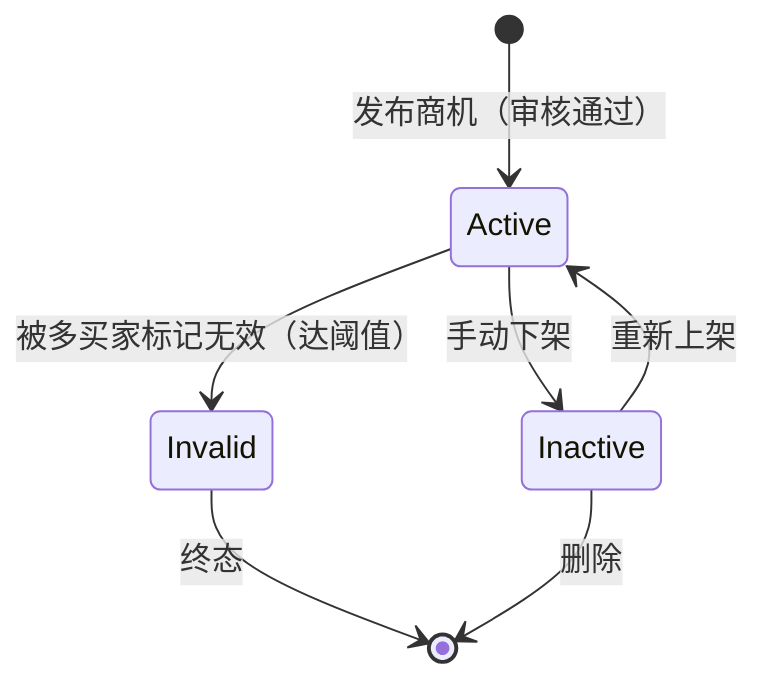

# 商机（Opportunity）

商机代表一个酒店行业项目机会，由用户（供应商/服务商）发布到平台，其他用户购买后可查看详情、联系方式，并录入 CRM 进行跟进。

## 什么是商机？

商机是平台的核心交易标的。发布者（投稿人）上传酒店项目需求信息（如装修总包、弱电总包、设备采购等），设定积分价格。购买者支付积分后解锁商机详情，获得联系方式与完整描述，进而转化为自己的 CRM 客户进行跟进。

**关键特征**：
- 匿名发布：投稿人全匿名保护，购买者无法获取发布者真实身份
- 相似度检测：新投稿自动检测与现有商机的相似度，防止重复发布
- 状态流转：active（在售）/ inactive（下架）/ invalid（被判无效）
- 价格机制：积分定价，受系统配置的上下限约束

## 代码位置

| 方面 | 位置 |
|------|------|
| 数据库表 | `opportunities`、`opportunity_categories`、`opportunity_tags`、`opportunity_tag_relations`、`opportunity_invalid_marks` |
| 后端路由 | `server/routes/opportunity.routes.js` |
| 前端页面 | `miniapp/src/pages/opportunity/detail.vue`、`publish.vue`、`mine.vue` |
| 前端列表 | `miniapp/src/pages/hall/hall.vue`、`miniapp/src/pages/index/index.vue` |
| API 方法 | `miniapp/src/api/index.js` 中的 `opportunities`、`opportunity`、`createOpportunity`、`updateOpportunity`、`markInvalid` |

## 关键字段

| 字段 | 类型 | 描述 |
|------|------|------|
| `id` | INT | 唯一标识 |
| `user_id` | INT | 发布者用户 ID |
| `title` | VARCHAR | 商机标题 |
| `category_id` | INT | 分类 ID |
| `description_public` | TEXT | 公开描述（购买前可见） |
| `description_full` | TEXT | 完整描述（购买后可见） |
| `contact_name` | VARCHAR | 联系人（购买后可见） |
| `contact_phone` | VARCHAR | 联系电话（购买后可见） |
| `wechat` | VARCHAR | 微信号（购买后可见） |
| `city` | VARCHAR | 所在城市 |
| `address` | VARCHAR | 详细地址 |
| `hotel_name` | VARCHAR | 酒店名称 |
| `brand` | VARCHAR | 品牌 |
| `stage` | VARCHAR | 项目阶段 |
| `price` | INT | 积分价格 |
| `status` | ENUM | active / inactive / invalid |
| `purchase_count` | INT | 购买次数 |
| `view_count` | INT | 浏览次数 |
| `invalid_mark_count` | INT | 被标记无效次数 |
| `similarity_hash` | VARCHAR | 相似度哈希（防重复） |

## 生命周期

## 价格机制

- 购买时按发布者会员等级计算折扣：`actualPrice = price * (1 - discountRate)`
- 卖家收入：`actualPrice * (1 - platformCommissionRate)`
- 平台抽成比例：`system_configs.platform_commission_rate`（默认 0.20）

## 安全与匿名

- 投稿人全匿名：前端展示固定「匿名投稿人」，接口不返回真实昵称和公司
- 相似度检测：新投稿与现有 active 商机做 TF 向量余弦相似度 + 编辑距离混合检测，超过阈值（默认 0.80）拒绝发布
- 无效标记：仅购买者可以标记，达阈值（无效判定比例）自动下架
