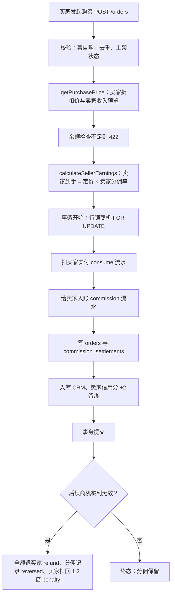

# 分佣结算逻辑与测算（方案 B：定价制）

更新：2026-09-05（方案 B 实施）｜基准：`server/services/level.service.js`、`server/routes/order.routes.js`、`server/routes/opportunity.routes.js`、`server/migrations/018_plan_b_levels.js`
配套脚本：`server/scripts/commission-sim.mjs`（`cd server && node --env-file-if-exists=.env scripts/commission-sim.mjs`，直接读现库参数）

规格文档：`.monkeycode/specs/commission-plan-b/`（requirements.md R1~R8 / design.md / tasklist.md）

---

## 1. 核心口径（定价制）

- **卖家到手 = round(商机定价 × 卖家等级分佣率)**，与买家的实付金额完全解耦。
- **买家实付 = round(商机定价 × 买家等级折扣)**。
- **平台留存 = 买家实付 − 卖家到手**。高级会员折扣产生的少收部分由流通池承担（池即平台沉淀的积分池）。
- **安全缓冲**：最低买家折扣 0.85 ≥ 最高卖家分佣率 0.80，任何等级组合下平台留存均 ≥ 0，穿仓不可能发生。迁移 018 与等级配置 PUT 接口双重强制该校验。

## 2. 等级两档参数（member_levels）

| 等级 | key | 买家折扣 | 卖家分佣率 | 免审 | 晋升门槛 |
|---|---|---|---|---|---|
| 普通会员 | normal | 1.00（原价） | 0.76 | 否 | 注册即获得 |
| 高级会员 | premium | 0.85（85折） | 0.80 | 是 | 购买率≥30%、无效率≤10%、有用率≥20%、活跃度≥50 |

- 旧四档（normal/silver/gold/expert）已由迁移 018 归并：silver→normal、gold/expert→premium；`member_levels.level_key` 与 `user_level_stats.level` 两处 ENUM 均收紧为 ('normal','premium')；历史数据不回改。
- 晋升判定 bug 已修复：`recalculateAllLevels` 按 sort_order **降序**取首个满足门槛的档位（旧逻辑升序 + break 导致所有人恒为普通）。

## 3. 全链路流程

## 4. 公式与代码对应

| 步骤 | 公式 | 参数来源 | 代码位置 |
|---|---|---|---|
| 买家实付 | R(定价 × 买家折扣) | member_levels.purchase_discount（按买家等级） | level.service.js `getPurchasePrice` |
| 卖家到手 | R(定价 × 卖家分佣率) | member_levels.seller_commission_rate（按卖家等级） | level.service.js `calculateSellerEarnings` |
| 平台留存 | 买家实付 − 卖家到手 | 派生值 | order.routes.js 下单事务 |
| 判无效回扣 | R(已发分佣合计 × (1 + invalid_penalty_rate)) | system_configs.invalid_penalty_rate = 0.20 | opportunity.routes.js clawback 段 |

`commission_settlements` 记账口径（方案 B 代）：`seller_income` = 实发全额、`level_bonus` = 0、`platform_rate` = platform_commission/order_amount（池留存率）。判无效回扣按 `SUM(seller_income + level_bonus)` 求和，与净额制旧代记录兼容。

## 5. 测算（定价 100）

| 买家 | 实付 | 卖家 | 卖家到手 | 平台留存 |
|---|---|---|---|---|
| 普通 | 100 | 普通 | 76 | 24 |
| 普通 | 100 | 高级 | 80 | 20 |
| 高级 | 85 | 普通 | 76 | 9 |
| 高级 | 85 | 高级 | 80 | 5 |

要点：卖家收益只随卖家等级与定价变动；高级买家付 85、卖家仍按定价拿 76/80，差额 9/5 由池承担。极值组合（高级买普通卖 9）仍为正，安全缓冲生效。

## 6. 废止项

- `system_configs.platform_commission_rate`、`seller_commission_base_rate` 两键已从配置表、seed、双端配置页（admin-pc ConfigsView / miniapp pages/admin/configs.vue）移除。
- `member_levels.commission_bonus` 列保留但不再参与任何计算；PC 等级编辑表单字段已替换为「卖家分佣率」。
- 旧净额制公式（平台抽成 → 净额 → 基准×(1+加成)）全面退役。

## 7. 校验方式

- 单测：`server/test/admin-fixes.test.js`（方案 B 用例：两档参数、解耦断言、改率即时生效、预览口径一致），全量 `npm test` 99 例。
- 测算：`node --env-file-if-exists=.env scripts/commission-sim.mjs` 输出全矩阵、反推定价、回扣测算与真实函数校验。
