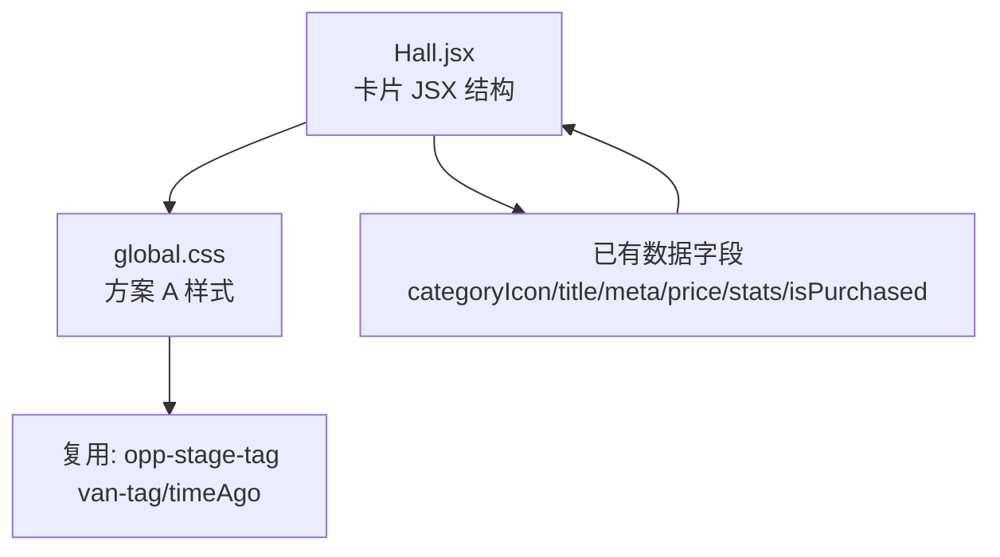

# 2026-08-19 商机卡片重构（方案 A：信息卡片流）

Feature Name: 2026-08-19-opportunity-card-redesign
Updated: 2026-08-19

## Description

将商机大厅卡片从「单栏紧凑结构」重构为「左图右文信息卡片流」：左侧 44px 圆角分类图标块，右侧文字信息分区清晰（标题/标题截断、meta、底部信息带）。已解锁商机以浅绿色背景 + 左侧绿色边框 + `✓` 对勾 + 「已解锁」标签区分，正文保持深色可读。

纯前端改动，不涉及后端接口、数据模型与任何路由变更。

## Architecture

本次无新增后端服务、无数据流变更，仅改动前端展示层两个文件。



### 说明

- 数据来源为既有 `api.opportunities` 返回字段，无新增字段。
- 卡片由 `Hall.jsx` 扁平 struct 重构为语义化的 `header + icon + info + footer` 分层结构。
- 样式集中于 `global.css` 的商机卡片区块，清理既有旧「深色图块」残留样式。

## Components and Interfaces

### Hall.jsx 卡片结构（重构后 DOM 层次）

```
.opportunity-card[.purchased]
├─ .opportunity-card__header (flex, align-center)
│  ├─ .opportunity-card__icon        —— 44×44 圆角色块（categoryIcon）
│  └─ .opportunity-card__info (flex:1, min-width:0)
│     ├─ .opportunity-card__title    —— ✓(已购) + 单行截断标题 + 「已解锁」标签
│     ├─ .opportunity-card__meta     —— 品牌 · 城市 + 阶段标签
│     └─ .opportunity-card__new-share—— 已购且有新共享跟进时的提醒
└─ .opportunity-card__footer
   ├─ .opportunity-card__price       —— 🔒(未购) + 价格积分
   └─ .opportunity-card__stats       —— 购买人数 Tag + 时间
```

### 关键样式（global.css）

| Selector | 作用 |
|----------|------|
| `.opportunity-card__icon` | 44px 圆角色块、居中、字体放大 |
| `.opportunity-card__title` | 单行截断（`overflow:hidden; text-overflow:ellipsis; white-space:nowrap`） |
| `.opportunity-card__footer` | `flex; space-between` 分隔底部信息带，上边框 `#f2f3f5` |
| `.opportunity-card.purchased` | 浅绿渐变背景 + 左侧 3px `#07c160` 绿边 |
| `.opportunity-card__purchased-mark` | 16px 绿色圆形 `✓` |
| `.opportunity-card__purchased-tag` | 「已解锁」浅绿标签 |

## Data Models

无后端/数据库变更。卡片消费的字段（来自 `POST /api/opportunities` 列表接口）不变：

- `title`, `categoryIcon`, `brand`/`hotelName`, `city`, `stage`, `price`, `purchaseCount`, `createdAt`, `isPurchased`, `totalShares`, `latestShareAt`

## Correctness Properties

- 标题始终单行截断，不因超长破坏卡片高度对齐（单栏列表项等高）。
- 已购买卡片：背景为浅绿渐变，文字（标题/meta/价格）保持深色，满足可读性，不出现「白字浅底」问题。
- 已购买卡片有效提升对比度后，`✓` 对勾、`已解锁` 标签与新共享跟进提醒可共存且不重叠。
- 未购买卡片：价格前保留 `🔒` 锁图标，价格红色强调。
- 卡片点击跳转行为不变，状态含义与详情页一致。

## Error Handling

- `categoryIcon` 缺失时回退为 `📦`（既有逻辑，保持不变）。
- 品牌/城市缺失时显示「未知品牌」「未知城市」回退文案（既有逻辑，保持不变）。
- `totalShares`/`viewedShares` 解析失败时静默忽略，不渲染新共享提醒（既有 `try/catch` 保持）。

## Test Strategy

- 复用既有前端断言：`hall.test.jsx`（渲染不崩溃）、`home-hall.test.jsx`（标题/积分/已解锁/人已购文本）。
- 重构后必须保证 `已解锁`、`N 人已购`、标题、价格积分等文本元素仍可被 `getByText/getAllByText` 匹配。
- 全量前端 vitest 以 `--no-file-parallelism --maxWorkers=1` 串行跑，目标 105/105 全绿。
- HMR 后使用 `13800000002`（已购 id 8）与未购账号核对卡片视觉。

## References

^1: (Filename#L1062) - [global.css 商机卡片样式起点](client/src/styles/global.css)
^2: (Filename#L110) - [Hall.jsx 商机卡片 JSX](client/src/pages/Hall.jsx)
^3: (Filename#L88) - [机会列表接口字段映射](server/routes/opportunity.routes.js)