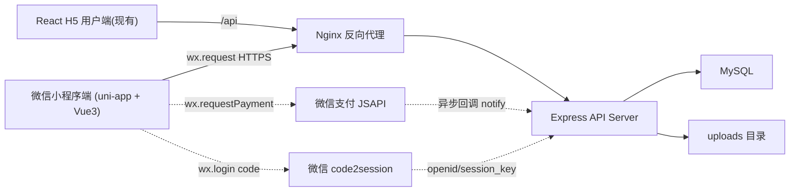

# 微信小程序改造设计文档

Feature Name: 2026-08-26-wechat-miniapp
Updated: 2026-08-26

## Description

将「跟单互助 · 酒店供应链在线跟单系统」用户端从 React H5 改造成微信小程序。选型（用户已确认）：

- 小程序端：**uni-app + Vue 3**，新建独立工程，迁移全部用户端功能
- 管理后台：**保留 React + antd Web 形态，不做改动**
- 后端：Express + MySQL API 大部分复用，新增微信登录 / 手机号绑定 / 微信支付三个能力

小程序与现有 H5 **共享同一后端与数据库**，账号体系、积分、订单、商机、CRM 数据互通。

## Architecture



```mermaid
graph LR
    A["微信小程序端 `miniapp/` 工程"] --> B["`/api` 业务接口(复用)"]
    A --> C["`/api/auth/wechat-login`(新增)"]
    A --> D["`/api/auth/bind-wechat`(新增)"]
    A --> E["`/api/auth/phone`(新增)"]
    A --> F["`/api/points/recharge`(启用 wechat 渠道)"]
    C --> G["公众号基础能力 API"]
    D --> G
    E --> G
```

### 关键设计决策

| 决策 | 理由 |
|------|------|
| uni-app + Vue3，与 Web H5 并存目录 `miniapp/` | 用户确认选型；Vue 语法重写成本已知，相对原生 WXML 多端可扩展 |
| 复用现有 `/api` 全部业务接口 | 后端业务逻辑零改动，商机/CRM/积分/订单接口天然跨端 |
| 微信登录走后端 code2session | appsecret 不落客户端，openid 归属校验在服务端完成 |
| 微信支付补全现有 `wechat.js` adapter | 支付抽象层已存在，仅实现 JSAPI 下单/验签/查单三方法 |
| 手机号获取用 `getPhoneNumber` code 换号 | 符合微信 2023 新规（模拟器可用测试号），不做静态密码方式 |
| 域名统一 nginx 反代 HTTPS | 满足 request/uploadFile/下载签名等合法域名要求，复用现有 trust proxy |

## Components and Interfaces

### 一、后端新增组件

#### 1. `server/services/wechat.service.js`（新增）

微信基础 API 封装：

```js
// code -> openid/session_key/unionid
async function code2Session(code) // GET https://api.weixin.qq.com/sns/jscode2session

// getPhoneNumber 返回的 code -> 手机号（需 access_token）
async function getPhoneNumber(code) // POST https://api.weixin.qq.com/wxa/business/getuserphonenumber

// 获取小程序 access_token（缓存 2 小时）
async function getAccessToken()
```

配置读取 `config.wechat`：`appId`/`appSecret`（新增），与支付 `config.payment.wechat.appId` 同源，pay 侧可复用。

#### 2. `server/migrations/014_wechat_binding.js`（新增）

幂等迁移，`users` 表追加：

```sql
ALTER TABLE users
  ADD COLUMN wechat_openid   VARCHAR(64) NULL DEFAULT NULL,
  ADD COLUMN wechat_unionid  VARCHAR(64) NULL DEFAULT NULL;
CREATE UNIQUE INDEX idx_users_wechat_openid ON users (wechat_openid);
```

#### 3. `server/routes/auth.routes.js`（扩展）

新增 3 个接口（挂 `/api/auth/`，`authRequired` 保护绑定与换号）：

| 接口 | 方法 | 入参 | 出参（code 0 时 data） |
|------|------|------|----------------------|
| `/api/auth/wechat-login` | POST | `{ code }` | 已绑定：`{ token, refreshToken, user, bound:true }`；未绑定：`{ bound:false, openid, unionid }` |
| `/api/auth/bind-wechat` | POST | `{ openid, phone, nickname?, inviteCode? }` | `{ token, refreshToken, user }`（手机号已存则绑定 openid；未存则开新号） |
| `/api/auth/phone` | POST | `{ code }` | `{ phone }`（服务端调 getPhoneNumber 解密） |

**安全约束**：
- `wechat-login` 无登录态可调用，仅消费 wx.login code，配合 `loginLimiter` 限流
- `bind-wechat` 强制校验 openid 参数格式（28 位字母数字），禁止任意 phone 绑定非本次会话 openid
- `phone` 解密失败返回统一 400，不泄露参数细节

#### 4. `server/middleware/wx-openid.lock.js`（新增，可选）

防御绑定刷号：对同一 openid/phone 组合做 Redis/DB 幂等（事务内 `SELECT ... FOR UPDATE`），并发绑定只成功一次。

#### 5. `server/services/payment/wechat.js`（补全）

现有占位 adapter 补全三个方法，依赖 `wechatpay-node-v3` 或自实现 v3 签名：

```js
async createPayment({ orderNo, amount, price, subject, openid })
  // POST /v3/pay/transactions/jsapi
  // 返回 { payMethod:'jsapi', payData:{ timeStamp,nonceStr,package,signType,paySign } }
async queryOrder({ orderNo, payChannelOrderNo })
  // GET /v3/pay/transactions/out-trade-no/{orderNo}
  // 返回 { status:'paid'|'pending'|'failed', paidAt }
async verifyNotify(headers, rawBody)
  // 校验：Wechatpay-Signature / 平台证书验签 + Wechatpay-Timestamp 防重放(5min) + Nonce
  // 返回 true/false
async parseNotifyResult(headers, rawBody)
  // 解密 resource.ciphertext -> { orderNo, payChannelOrderNo(transaction_id), paidAmount, paidAt }
```

`createRechargeOrder` 增加透传 `openid`（`BasePaymentAdapter.createPayment` 载荷字段已预留）。

#### 6. `server/config.js`（扩展）

```js
wechat: {
  appId: process.env.WECHAT_APPID || '',
  appSecret: process.env.WECHAT_APPSECRET || '',
}
```

### 二、小程序端组件（`miniapp/`，uni-app + Vue3）

```
miniapp/
├── src/
│   ├── App.vue
│   ├── main.js
│   ├── manifest.json          # 微信小程序 appid 配置
│   ├── pages.json             # 页面路由 + tabBar(5 tab)
│   ├── common/
│   │   ├── request.js         # uni.request 封装：JWT + 401 自动刷新 + 重试
│   │   ├── storage.js         # uni.setStorageSync 封装（token/user/refresh）
│   │   ├── constants.js        # 分类/标签/订单状态等常量（对齐 H5 constants.js）
│   │   └── config.js           # BASE_URL / API_BASE
│   ├── api/                   # 按域拆：auth/opportunity/order/points/crm/followUp/community
│   ├── store/                 # Pinia：user(auth)、points、notification
│   ├── components/            # 商机卡片/分类选择/附件网格/空状态/海报等复用组件
│   ├── utils/                 # 相似度检测提示、金额/积分格式化、分享封装
│   └── pages/                 # 按 R1-R8 映射页面（见下）
└── package.json
```

**页面映射（对齐现有 App.jsx 路由）：**

| 小程序路径 | 对应 R | 说明 |
|-----------|--------|------|
| pages/index/index | R3 | 首页（Banner/公告/快捷入口） |
| pages/hall/hall | R3 | 互助大厅（列表/筛选/搜索/分页） |
| pages/opportunity/detail | R3 | 商机详情 + 积分解锁 |
| pages/opportunity/publish | R4 | 发布跟单 + 相似度提示 |
| pages/crm/index | R5 | CRM 列表 |
| pages/crm/add | R5 | 新增客户 |
| pages/crm/detail | R5 | 客户详情 + 跟进 |
| pages/followup/share | R5 | 跟进分享回看 |
| pages/profile/index | R1/R2/R7 | 我的（资料/安全/订单/权益入口） |
| pages/profile/edit | R7 | 资料编辑 |
| pages/order/list | R6 | 我的订单 |
| pages/points/index | R6 | 积分余额/流水 |
| pages/points/recharge | R6 | 充值 + wx.requestPayment |
| pages/points/result | R6 | 支付结果 |
| pages/community/level | R7 | 会员等级 |
| pages/community/credit | R7 | 信用分 |
| pages/community/invite | R7 | 邀请好友 |
| pages/community/ranking | R7 | 排行榜 |
| pages/community/notify | R7 | 通知中心 |
| pages/community/reminder | R7 | 提醒中心 |
| pages/common/agreement | R7 | 用户协议/隐私政策 |
| pages/common/announcement | R7 | 公告详情 |
| pages/login/index | R1 | 登录（微信一键 + 手机号） |
| pages/login/bind | R1 | 手机号绑定 |
| pages/login/forgot | R2 | 找回密码 |

### 三、核心接口透传约定

小程序端 `api/*.js` 镜像 H5 `client/src/api/index.js` 的方法签名与参数，仅网络层替换：

| H5 原用法 | 小程序替换 |
|-----------|-----------|
| `fetch(BASE + path)` | `uni.request({ url: API_BASE + path })` |
| `localStorage.getItem/setItem` | `uni.getStorageSync / setStorageSync` |
| `window.location.href = '/login'` | `uni.reLaunch({ url: '/pages/login/index' })`（经 store 登出） |
| FormData 上传 | `uni.uploadFile`（name=`file` 或 `files`，对齐后端 multer 字段名） |
| 图片选择 | `uni.chooseImage` + 上传后回填 URL |

**401 自动刷新**：`request.js` 拦截 `{code:401}`，若 refreshToken 存在则 `POST /auth/refresh` 更新双 token 后重放原请求；失败则清空登录态并 `reLaunch` 登录页；同 H5 的 MAX_RETRIES=1 / 5xx 重试逻辑保持一致。

**支付拉起（R6-4）**：

```js
const payData = await api.startRecharge({ amount, channel:'wechat' });
// 判断：payData.payMethod === 'jsapi' -> wx.requestPayment({ ...payData.payData })
//        payData.channel === 'mock'    -> 走模拟支付按钮
const res = await api.queryRechargeOrder(orderNo) // 轮询或支付回调后查询
```

## Data Models

### users（新增列，migration 014）

| 列 | 类型 | 约束 | 说明 |
|----|------|------|------|
| wechat_openid | VARCHAR(64) | NULL, UNIQUE | 微信 openid，唯一索引防重复绑定 |
| wechat_unionid | VARCHAR(64) | NULL | 开放平台 unionid，预留跨端识别 |

### 绑定与登录流程状态

```
wx.login -> code
  └ /auth/wechat-login(code)
      ├── openid 关联 active 用户 -> 发 JWT，bound:true
      └── 无关联 -> 返回 { bound:false, openid }
            └── 引导授权手机号
                  └── /auth/phone(getPhoneNumber code) -> phone
                        ├── phone 已注册 -> /auth/bind-wechat(openid,phone) 绑定老号
                        └── phone 未注册 -> 收集昵称/邀请码 -> /auth/bind-wechat 开新号
```

### payment_orders（不变，复用）

新增 wechat 渠道后，`channel='wechat'`、`payMethod='jsapi'`、`prepaid_id` 存储 transaction_id，现有 `getOrderForUser` / `settleRechargeOrder` 幂等逻辑不变。

## Correctness Properties

- **注册/绑定唯一性**：一个 openid 至多关联一个非 deleted 用户；一个用户至多一个非空 openid（唯一索引强制）
- **绑定原子性**：`bind-wechat` 在单事务内执行「查 phone → 插/更新 users → 建 points_accounts/user_level_stats （新用户时）」；失败回滚不留半状态
- **支付幂等**：`settleRechargeOrder` 以 `FOR UPDATE` 锁行，重复回调只入账一次（已有保证，复用）
- **积分一致性**：新用户创建时 points_accounts 与 user_level_stats 同步初始化，注册赠送积分使用 system_configs 当前值
- **令牌一致性**：wechat 登录签发与 H5 登录同规格 token/refreshToken，`token_version` 变更后微信端旧令牌同步失效
- **限流**：`wechat-login`、`phone`、`bind-wechat` 均挂登录限流中间件，失败重试窗口防刷

## Error Handling

| 场景 | 处理 |
|------|------|
| `wx.login` 失败 / code 过期 | 提示「微信登录失败，请重试」；可重试 |
| code2session 返回 errcode（如 appid 未配置） | 后端 500 + 日志；前端展示「微信服务暂不可用」并提供手机号+密码登录降级 |
| openid 未绑定 | 返回 `bound:false`，前端进入手机号绑定页（不报错） |
| 手机号未授权 / getPhoneNumber code 无效 | 后端 400 统一文案「手机号获取失败，请重试」；前端 button 重新触发授权 |
| 绑定手机号已注册且 openid 已被他人绑定 | 400「该手机号已绑定其他微信账号」，引导去 Web 端登录解绑 |
| 微信支付未配置商户（开发环境） | `createRechargeOrder` 走 wechat 时抛「渠道未配置」，前端捕获取 offer mock 渠道降级 |
| 支付取消/超时 | 返回订单状态 pending/expired，充值页提示可重新支付；超时按现有 `orderTtl` 标记 expired |
| 域名未备案 / 请求白名单缺失 | 微信侧拦截请求（网络错误），运维在公众平台补配 request/uploadFile 域名，前端提示「网络配置错误，请联系管理员」 |
| 401 刷新失败 | 清登录态 reLaunch 登录页，不静默挂起 |

## Test Strategy

### 后端（node --test 扩展现有 test 套件）

1. `test/auth-wechat.test.js`（新增）：mock 微信 code2session / getPhoneNumber；覆盖「未绑定→返回 bound:false、绑定老号、开新号、重复绑定 400、banned 禁止、绑定并发仅一次成功、错误 code 500/400」
2. `test/payment-wechat.test.js`（新增）：mock 微信支付 v3 下单/回调；覆盖「jsapi payData 结构、verifyNotify 验签失败 400、回调重复结算只入账一次、金额不符拒绝、查单 paid 对账入账」
3. 回归：现有 `node --test test/*.test.js` 全绿（53 项不降）
4. Lint：`npm run lint --prefix server` 通过

### 小程序端（miniapp，Vitest + @vue/test-utils）

1. request.js 单测：401 触发 refresh 重放、refresh 失败清登录态、5xx GET 重试
2. api 层：透传参数与 H5 对齐（快照比较 method/path/body）
3. 登录绑定流程组件测试：bound:false → 手机号授权 → 绑定成功 → store 写入 token
4. 支付：payMethod=jsapi 调用 wx.requestPayment mock，mock 渠道走模拟支付分支
5. 构建验证：`npm run build:mp-weixin` 产物可被微信开发者工具导入

### 联调矩阵

| 场景 | 条件 |
|------|------|
| 新用户绑定 | 手机号未注册 → 开新号含注册赠送积分 |
| 老用户绑定 | H5 已注册手机号 → 绑定后微信登录直达，数据互通 |
| 双端会话 | H5 改密 → 小程序 refresh 失败需重登（token_version 校验） |
| 充值支付 | 微信支付 sandbox/真实商户 → 回调入账；未配置商户 → mock 降级 |

## References

[^1]: (Website) - [微信小程序运营规范 / code2session](https://developers.weixin.qq.com/miniprogram/dev/OpenApiDoc/user-login/code2Session.html)
[^2]: (Website) - [微信开放能力 getPhoneNumber](https://developers.weixin.qq.com/miniprogram/dev/OpenApiDoc/user-info/phone-number/getPhoneNumber.html)
[^3]: (Website) - [微信支付 JSAPI 下单 v3](https://pay.weixin.qq.com/docs/merchant/apis/jsapi-payment/direct-js/order.html)
[^4]: (Filename#L26-L44) - [server/services/payment/wechat.js](wechat.js) 占位 adapter，本次补全
[^5]: (Filename#L43-L87) - [server/services/payment/index.js](index.js) createRechargeOrder 载荷已预留 openid
[^6]: (Filename#L16-L44) - [server/config.js](config.js) 新增 wechat.appId/appSecret
[^7]: (Filename#L45-L104) - [client/src/api/index.js](api/index.js) 小程序 api 层镜像其方法签名
[^8]: (Filename#L39-L78) - [routes](routes) 现有 /api 业务路由全部复用