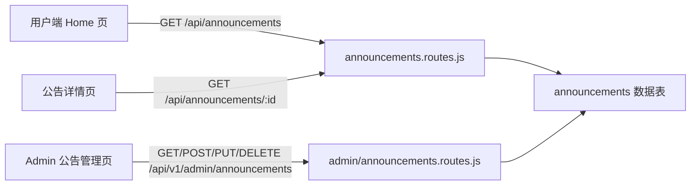

# 技术设计：全员公告栏（announcement-bulletin）

Feature Name: announcement-bulletin
Updated: 2026-08-13

## 描述

为平台新增全员可见的公告栏。公告栏展示在用户端首页顶部，支持混合形式内容（文本/图片/视频）。管理员通过后台管理公告（创建、编辑、上下线、删除、排序、置顶）。

## 架构

- 用户端公告列表与详情接口：`server/routes/announcements.routes.js`
- 管理端公告 CRUD 接口：`server/routes/admin/announcements.routes.js`
- 数据表：`announcements`（迁移文件 `server/migrations/003_announcements.js`）

## 组件与接口

### 数据模型：announcements 表

| 字段 | 类型 | 说明 |
|------|------|------|
| id | INT UNSIGNED PK AUTO_INCREMENT | 公告ID |
| title | VARCHAR(100) NOT NULL | 公告标题 |
| content | TEXT | 正文（支持文本） |
| media_type | ENUM('text','image','video','mixed') DEFAULT 'text' | 内容形式 |
| media_url | VARCHAR(500) | 附件地址（图片/视频） |
| link_url | VARCHAR(500) | 可选跳转链接 |
| is_top | TINYINT(1) DEFAULT 0 | 是否置顶 |
| sort_order | INT DEFAULT 0 | 排序值（越小越前） |
| status | ENUM('active','inactive') DEFAULT 'active' | 上线/下线 |
| start_at | TIMESTAMP NULL | 生效时间 |
| end_at | TIMESTAMP NULL | 失效时间 |
| created_at | TIMESTAMP DEFAULT CURRENT_TIMESTAMP | 创建时间 |
| updated_at | TIMESTAMP DEFAULT CURRENT_TIMESTAMP ON UPDATE CURRENT_TIMESTAMP | 更新时间 |

### 用户端接口

**GET /api/announcements**（需登录）
- 返回：`{ code: 0, data: { list: Announcement[] } }`
- 仅返回 `status='active'` 且当前时间在有效期内（`start_at <= NOW()` 且 `(end_at IS NULL OR end_at >= NOW())`）
- 排序：`is_top DESC, sort_order ASC, created_at DESC`

**GET /api/announcements/:id**（需登录）
- 返回：`{ code: 0, data: Announcement }`

### 管理端接口（/api/v1/admin/announcements）

| 方法 | 路径 | 说明 |
|------|------|------|
| GET | / | 公告列表（含分页，含已下线） |
| GET | /:id | 单个公告 |
| POST | / | 创建公告 |
| PUT | /:id | 更新公告 |
| DELETE | /:id | 删除公告 |

创建/更新字段：`title, content, mediaType, mediaUrl, linkUrl, isTop, sortOrder, startAt, endAt`（后端映射为 snake_case）。

## 正确性属性

- 用户端只能看到 `active` 且时间有效的公告
- 标题必填；正文与附件至少填一项才允许发布（文本公告允许仅标题+正文）
- 置顶公告优先展示，同级按 sort_order 升序
- 删除为物理删除（与 banner 管理一致）

## 错误处理

- 创建/更新时标题为空 → `{ code: 400, message: '标题不能为空' }`
- 创建/更新时正文与附件均为空 → `{ code: 400, message: '正文和附件不能同时为空' }`
- 数据库异常 → 500，返回对应中文错误信息

## 测试策略

- **后端**：`server/test/announcement.test.js` 覆盖创建、列表（含时间有效过滤）、详情、更新、下线、删除
- **前端用户端**：`client/test/home-hall.test.jsx` 增加首页公告栏渲染与点击用例；新增公告详情页测试
- **前端管理端**：`client/test/admin-pages.test.jsx` 增加公告管理页冒烟测试
- 公告接口使用 `Date.now()` 时间窗构造有效/失效数据保证幂等

## 参考

[^1]: (requirements.md) - 需求文档
