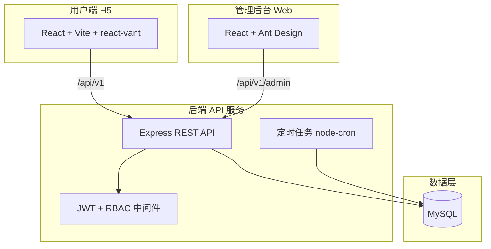
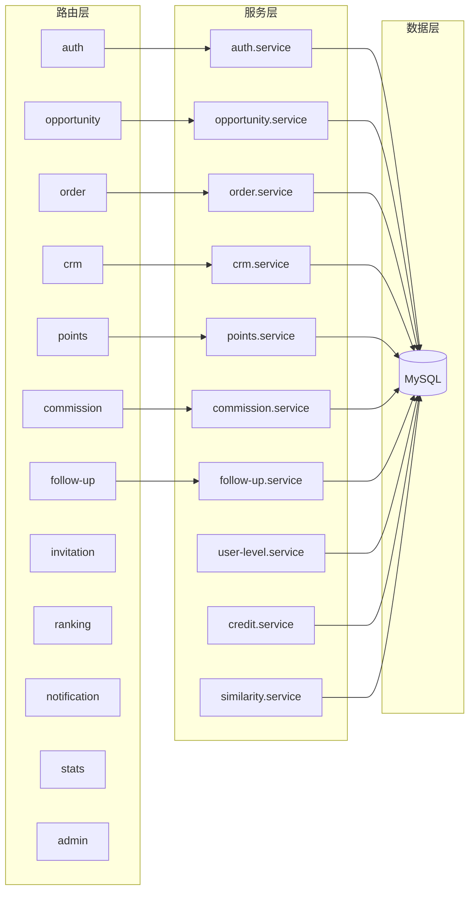
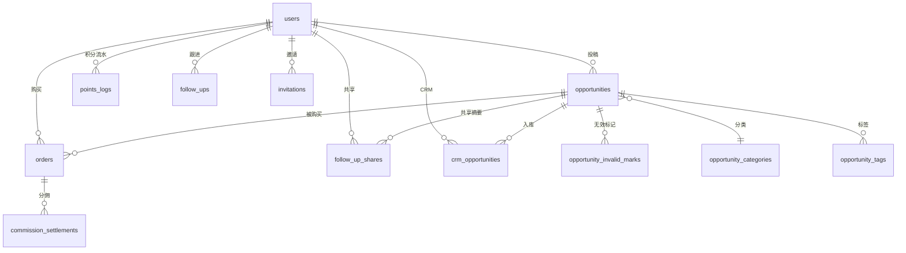
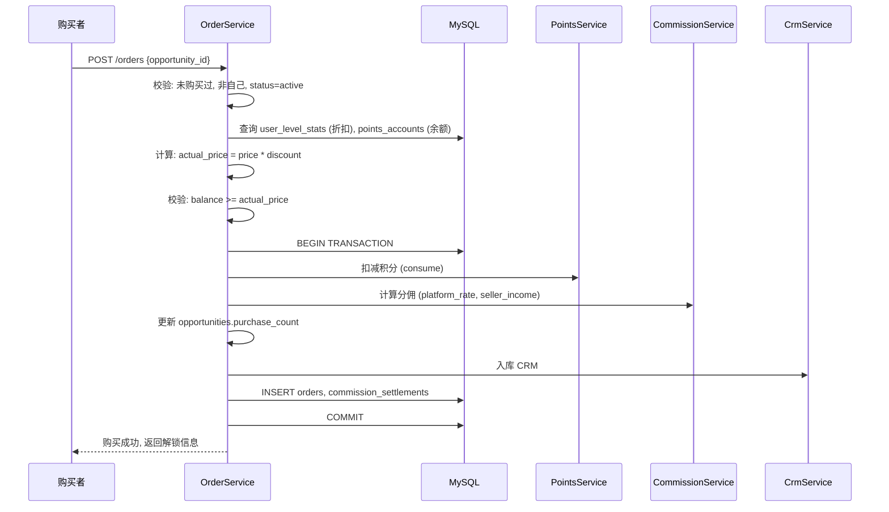
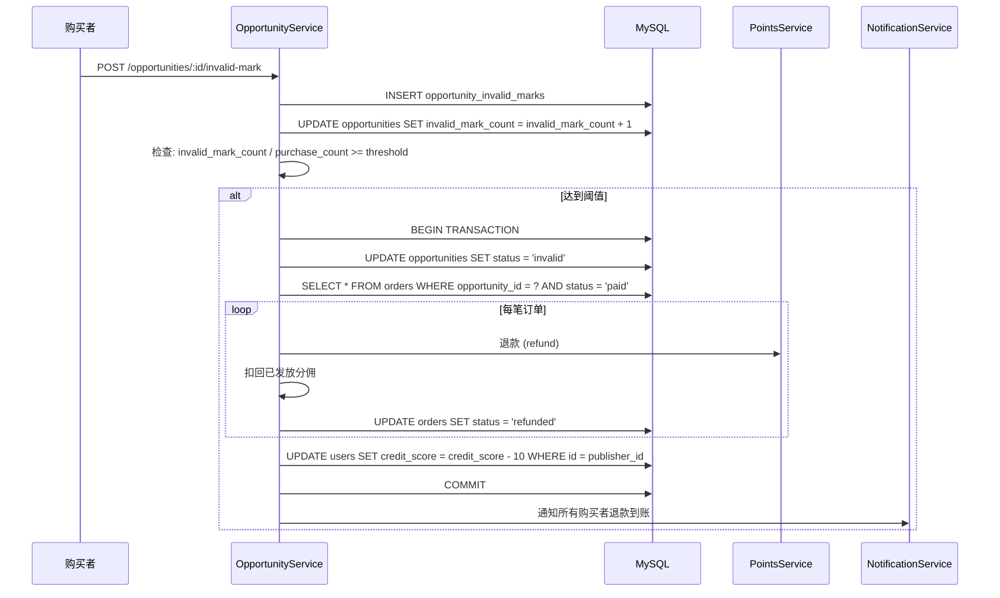
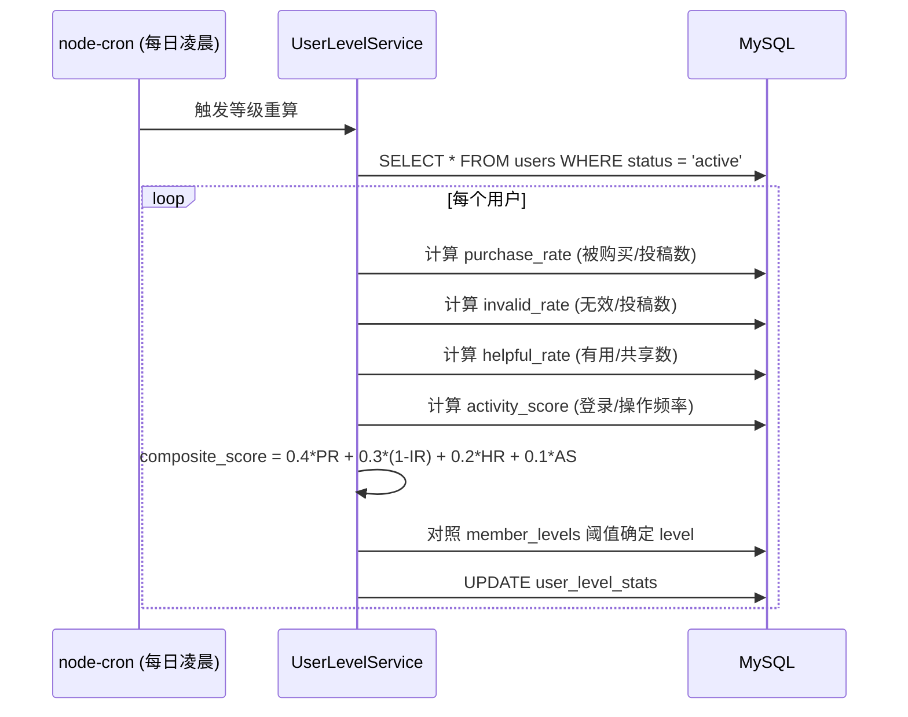

# 酒店供应链跟单互助平台 · 技术设计文档

Feature Name: hotel-order-follow-platform
Version: v1.0
Updated: 2026-08-04

---

## 1. Description

本技术设计文档将《商机平台正式需求文档 v4.0》的完整能力与现有《酒店供应链在线跟单系统》（H5 + Express + JSON）结合，采用 MySQL 持久化、"积分购买 + 分佣"商业模型，覆盖 H5 用户端 + Web 管理后台 + 后端 API 服务的 V1 完整版。

---

## 2. Architecture

### 2.1 系统总体架构



### 2.2 服务端模块架构



### 2.3 技术栈

| 层次 | 技术选型 | 说明 |
|------|----------|------|
| H5 用户端 | React 18 + Vite + react-vant 3 + @react-vant/icons | 保留现有框架 |
| 管理后台 | React 18 + Vite + Ant Design 5 | 新增 |
| 后端 API | Node.js + Express 4 | 改造升级 |
| 数据库 | MySQL 8 + mysql2 驱动 | 替换 JSON 文件 |
| 鉴权 | JWT（access + refresh token） | 改造现有 |
| 定时任务 | node-cron | 新增 |
| ID 生成 | nanoid | 保留 |

### 2.4 前端路由结构（H5）

| 路由 | 页面 | 说明 |
|------|------|------|
| `/login` | Login | 登录 |
| `/register` | Register | 注册（含邀请码） |
| `/` | Home | 首页/跟单列表 |
| `/opportunity/:id` | OpportunityDetail | 跟单详情（含购买解锁） |
| `/publish` | Publish | 投稿跟单 |
| `/crm` | CRM | 个人跟单库 |
| `/crm/:id` | CRMDetail | CRM 跟单详情 |
| `/crm/follow-up/:id` | FollowUpEdit | 新增/编辑跟进 |
| `/crm/notify` | ReminderCenter | 提醒中心 |
| `/profile` | Profile | 个人中心 |
| `/profile/edit` | ProfileEdit | 编辑资料 |
| `/points` | Points | 积分中心 |
| `/points/recharge` | Recharge | 积分充值 |
| `/points/flow` | PointsFlow | 积分明细 |
| `/member-level` | MemberLevel | 会员等级 |
| `/credit` | Credit | 信用分 |
| `/invite` | Invite | 邀请好友 |
| `/ranking` | Ranking | 排行榜 |
| `/notifications` | Notifications | 通知中心 |
| `/my/orders` | MyOrders | 我的投稿 |

### 2.5 前端路由结构（管理后台）

| 路由 | 页面 | 权限 |
|------|------|------|
| `/admin/login` | AdminLogin | 公开 |
| `/admin/dashboard` | Dashboard | 全部 |
| `/admin/opportunities` | OpportunityList | 运营/超管 |
| `/admin/follow-up-shares` | ShareAuditList | 运营 |
| `/admin/orders` | OrderList | 财务/超管 |
| `/admin/users` | UserList | 运营/超管 |
| `/admin/points` | PointsList | 财务/超管 |
| `/admin/finance` | FinanceDashboard | 财务/超管 |
| `/admin/member-levels` | LevelConfig | 超管 |
| `/admin/configs` | SystemConfigs | 超管 |
| `/admin/admins` | AdminManage | 超管 |
| `/admin/roles` | RoleManage | 超管 |
| `/admin/audit-log` | AuditLog | 超管 |
| `/admin/stats` | StatsDetail | 全部 |

---

## 3. Components and Interfaces

### 3.1 后端目录结构

```
server/
├── index.js                  # 入口，挂载路由 + 启动定时任务
├── db.js                     # MySQL 连接池 + 事务封装
├── auth.js                   # JWT 签发/校验
├── middleware/
│   ├── adminAuth.js          # 后台 JWT + RBAC 校验
│   ├── creditGuard.js        # 信用分校验中间件
│   └── errorHandler.js       # 统一异常处理
├── services/
│   ├── opportunity.service.js
│   ├── order.service.js
│   ├── points.service.js
│   ├── commission.service.js
│   ├── follow-up.service.js
│   ├── crm.service.js
│   ├── invitation.service.js
│   ├── ranking.service.js
│   ├── notification.service.js
│   ├── stats.service.js
│   ├── user-level.service.js
│   ├── credit.service.js
│   └── similarity.service.js
├── routes/
│   ├── auth.routes.js
│   ├── opportunity.routes.js
│   ├── order.routes.js
│   ├── points.routes.js
│   ├── follow-up.routes.js
│   ├── crm.routes.js
│   ├── invitation.routes.js
│   ├── ranking.routes.js
│   ├── notification.routes.js
│   ├── stats.routes.js
│   ├── config.routes.js
│   └── admin/
│       ├── auth.routes.js
│       ├── opportunity.routes.js
│       ├── user.routes.js
│       ├── order.routes.js
│       ├── points.routes.js
│       ├── level.routes.js
│       ├── config.routes.js
│       └── audit.routes.js
├── jobs/
│   ├── levelCalculate.js     # 每日凌晨等级重算
│   ├── pointsExpiry.js       # 过期积分清理
│   └── rankingCache.js       # 排行榜重算
├── utils/
│   ├── similarity.js         # 标题相似度检测
│   └── idGenerator.js        # 自定义 ID 生成
├── migrations/
│   └── 001_init.js           # 数据库初始化脚本
└── seeds/
    └── seed.js               # 开发环境种子数据
```

### 3.2 前端目录结构（H5）

```
client/src/
├── api/
│   ├── index.js              # 统一请求封装（JWT + refresh）
│   ├── auth.js
│   ├── opportunity.js
│   ├── order.js
│   ├── crm.js
│   ├── followUp.js
│   ├── points.js
│   ├── invitation.js
│   ├── ranking.js
│   └── notification.js
├── components/
│   ├── TabBar.jsx
│   ├── Icon.jsx
│   ├── OpportunityCard.jsx   # 改造现有 OrderCard
│   ├── MarketIntelligence.jsx
│   ├── ShareTimeline.jsx
│   ├── StatusBadge.jsx
│   └── Empty.jsx
├── pages/
│   ├── Login/ Register/ Home/ Hall/
│   ├── OpportunityDetail/    # 替换 OrderDetail
│   ├── Publish/ Profile/ ProfileEdit/
│   ├── CRM/ CRMDetail/ FollowUpEdit/ ReminderCenter/
│   ├── Points/ Recharge/ PointsFlow/
│   ├── MemberLevel/ Credit/ Invite/ Ranking/
│   ├── Notifications/ MyOrders/
├── context/
│   └── AuthContext.jsx
└── constants.js
```

### 3.3 前端目录结构（管理后台）

```
admin/src/
├── api/
│   ├── index.js, opportunity.js, user.js, order.js
│   ├── points.js, level.js, config.js, audit.js
├── pages/
│   ├── Login/ Dashboard/
│   ├── OpportunityList/ FollowUpShareAudit/
│   ├── OrderList/ UserList/ PointsList/
│   ├── FinanceDashboard/ LevelConfig/
│   ├── SystemConfigs/ AdminManage/ RoleManage/
│   ├── AuditLog/ StatsDetail/
├── components/
│   ├── Layout/ Charts/ Common/
└── hooks/
    └── useAdminAuth.js
```

---

## 4. Data Models

### 4.1 ER 关系图



### 4.2 核心表结构

#### users（用户）

```sql
CREATE TABLE users (
    id BIGINT UNSIGNED PRIMARY KEY AUTO_INCREMENT,
    phone VARCHAR(20) UNIQUE NOT NULL,
    password_hash VARCHAR(255),
    nickname VARCHAR(50) NOT NULL,
    avatar VARCHAR(500),
    company VARCHAR(100),
    category VARCHAR(50),
    bio TEXT,
    invite_code VARCHAR(20) UNIQUE,
    invited_by BIGINT UNSIGNED,
    status ENUM('active','banned') DEFAULT 'active',
    credit_score INT DEFAULT 100,
    created_at TIMESTAMP DEFAULT CURRENT_TIMESTAMP,
    updated_at TIMESTAMP DEFAULT CURRENT_TIMESTAMP ON UPDATE CURRENT_TIMESTAMP,
    deleted_at TIMESTAMP NULL
) ENGINE=InnoDB;
```

#### opportunities（跟单）

```sql
CREATE TABLE opportunities (
    id BIGINT UNSIGNED PRIMARY KEY AUTO_INCREMENT,
    user_id BIGINT UNSIGNED NOT NULL,
    title VARCHAR(200) NOT NULL,
    title_pinyin VARCHAR(500),
    category_id INT UNSIGNED NOT NULL,
    description_public TEXT,
    description_full TEXT,
    contact_name VARCHAR(50),
    contact_phone VARCHAR(30),
    city VARCHAR(50),
    hotel_name VARCHAR(100),
    stage VARCHAR(50),
    price INT NOT NULL COMMENT "积分定价",
    status ENUM('active','inactive','invalid') DEFAULT 'active',
    invalid_mark_count INT DEFAULT 0,
    purchase_count INT DEFAULT 0,
    view_count INT DEFAULT 0,
    valid_until DATE,
    similarity_hash VARCHAR(64),
    created_at TIMESTAMP DEFAULT CURRENT_TIMESTAMP,
    updated_at TIMESTAMP DEFAULT CURRENT_TIMESTAMP ON UPDATE CURRENT_TIMESTAMP,
    deleted_at TIMESTAMP NULL,
    FOREIGN KEY (user_id) REFERENCES users(id),
    FOREIGN KEY (category_id) REFERENCES opportunity_categories(id),
    INDEX idx_user_id (user_id),
    INDEX idx_category_id (category_id),
    INDEX idx_status (status),
    INDEX idx_created_at (created_at)
) ENGINE=InnoDB;
```

#### opportunity_categories（分类）

```sql
CREATE TABLE opportunity_categories (
    id INT UNSIGNED PRIMARY KEY AUTO_INCREMENT,
    name VARCHAR(50) NOT NULL,
    icon VARCHAR(100),
    sort_order INT DEFAULT 0,
    status ENUM('active','inactive') DEFAULT 'active',
    created_at TIMESTAMP DEFAULT CURRENT_TIMESTAMP
) ENGINE=InnoDB;
```

#### opportunity_tags（标签）

```sql
CREATE TABLE opportunity_tags (
    id INT UNSIGNED PRIMARY KEY AUTO_INCREMENT,
    name VARCHAR(50) NOT NULL,
    created_at TIMESTAMP DEFAULT CURRENT_TIMESTAMP
) ENGINE=InnoDB;

CREATE TABLE opportunity_tag_relations (
    opportunity_id BIGINT UNSIGNED NOT NULL,
    tag_id INT UNSIGNED NOT NULL,
    PRIMARY KEY (opportunity_id, tag_id),
    FOREIGN KEY (opportunity_id) REFERENCES opportunities(id) ON DELETE CASCADE,
    FOREIGN KEY (tag_id) REFERENCES opportunity_tags(id) ON DELETE CASCADE
) ENGINE=InnoDB;
```

#### opportunity_invalid_marks（无效标记）

```sql
CREATE TABLE opportunity_invalid_marks (
    id BIGINT UNSIGNED PRIMARY KEY AUTO_INCREMENT,
    opportunity_id BIGINT UNSIGNED NOT NULL,
    user_id BIGINT UNSIGNED NOT NULL,
    reason ENUM('contact_invalid','info_fake','duplicate','other') NOT NULL,
    reason_text TEXT,
    created_at TIMESTAMP DEFAULT CURRENT_TIMESTAMP,
    FOREIGN KEY (opportunity_id) REFERENCES opportunities(id),
    FOREIGN KEY (user_id) REFERENCES users(id),
    UNIQUE KEY uk_opp_user (opportunity_id, user_id)
) ENGINE=InnoDB;
```

#### orders（订单）

```sql
CREATE TABLE orders (
    id BIGINT UNSIGNED PRIMARY KEY AUTO_INCREMENT,
    user_id BIGINT UNSIGNED NOT NULL,
    opportunity_id BIGINT UNSIGNED NOT NULL,
    original_price INT NOT NULL,
    discount_rate DECIMAL(4,2) NOT NULL DEFAULT 1.00,
    actual_price INT NOT NULL COMMENT "实付积分",
    platform_commission INT NOT NULL,
    seller_income INT NOT NULL,
    status ENUM('paid','refunded') DEFAULT 'paid',
    refunded_at TIMESTAMP NULL,
    created_at TIMESTAMP DEFAULT CURRENT_TIMESTAMP,
    FOREIGN KEY (user_id) REFERENCES users(id),
    FOREIGN KEY (opportunity_id) REFERENCES opportunities(id),
    UNIQUE KEY uk_user_opp (user_id, opportunity_id),
    INDEX idx_user_id (user_id),
    INDEX idx_created_at (created_at)
) ENGINE=InnoDB;
```

#### points_accounts + points_logs（积分账户与流水）

```sql
CREATE TABLE points_accounts (
    user_id BIGINT UNSIGNED PRIMARY KEY,
    balance INT DEFAULT 0,
    total_recharged INT DEFAULT 0,
    total_consumed INT DEFAULT 0,
    total_expired INT DEFAULT 0,
    updated_at TIMESTAMP DEFAULT CURRENT_TIMESTAMP ON UPDATE CURRENT_TIMESTAMP,
    FOREIGN KEY (user_id) REFERENCES users(id)
) ENGINE=InnoDB;

CREATE TABLE points_logs (
    id BIGINT UNSIGNED PRIMARY KEY AUTO_INCREMENT,
    user_id BIGINT UNSIGNED NOT NULL,
    delta INT NOT NULL COMMENT "正为获得负为消耗",
    balance_after INT NOT NULL,
    source_type ENUM('register_gift','invite_gift','purchase_income','commission',
                     'reward','consume','expire','recharge','admin_adjust') NOT NULL,
    source_id BIGINT UNSIGNED,
    source_title VARCHAR(200),
    expires_at TIMESTAMP NULL,
    created_at TIMESTAMP DEFAULT CURRENT_TIMESTAMP,
    FOREIGN KEY (user_id) REFERENCES users(id),
    INDEX idx_user_id (user_id),
    INDEX idx_source_type (source_type),
    INDEX idx_created_at (created_at)
) ENGINE=InnoDB;
```

#### commission_settlements（分佣结算）

```sql
CREATE TABLE commission_settlements (
    id BIGINT UNSIGNED PRIMARY KEY AUTO_INCREMENT,
    order_id BIGINT UNSIGNED NOT NULL,
    seller_id BIGINT UNSIGNED NOT NULL,
    order_amount INT NOT NULL,
    platform_rate DECIMAL(4,2) NOT NULL,
    platform_commission INT NOT NULL,
    seller_income INT NOT NULL,
    level_bonus INT DEFAULT 0,
    status ENUM('paid','reversed') DEFAULT 'paid',
    created_at TIMESTAMP DEFAULT CURRENT_TIMESTAMP,
    FOREIGN KEY (order_id) REFERENCES orders(id),
    FOREIGN KEY (seller_id) REFERENCES users(id),
    INDEX idx_seller_id (seller_id)
) ENGINE=InnoDB;
```

#### follow_ups（私有跟进）

```sql
CREATE TABLE follow_ups (
    id BIGINT UNSIGNED PRIMARY KEY AUTO_INCREMENT,
    crm_opportunity_id BIGINT UNSIGNED NOT NULL,
    user_id BIGINT UNSIGNED NOT NULL,
    status ENUM('initial_contact','interested','negotiating','closed','invalid') DEFAULT 'initial_contact',
    content_private TEXT COMMENT "私有跟进内容",
    next_follow_date DATE,
    created_at TIMESTAMP DEFAULT CURRENT_TIMESTAMP,
    FOREIGN KEY (crm_opportunity_id) REFERENCES crm_opportunities(id),
    FOREIGN KEY (user_id) REFERENCES users(id)
) ENGINE=InnoDB;
```

#### follow_up_shares（共享摘要）

```sql
CREATE TABLE follow_up_shares (
    id BIGINT UNSIGNED PRIMARY KEY AUTO_INCREMENT,
    user_id BIGINT UNSIGNED NOT NULL,
    opportunity_id BIGINT UNSIGNED NOT NULL,
    follow_up_id BIGINT UNSIGNED,
    status ENUM('initial_contact','interested','negotiating','closed','invalid') NOT NULL,
    summary VARCHAR(500),
    helpful_count INT DEFAULT 0,
    report_count INT DEFAULT 0,
    audit_status ENUM('pending','approved','rejected') DEFAULT 'pending',
    audit_reason VARCHAR(200),
    audit_admin_id BIGINT UNSIGNED,
    is_anonymous TINYINT(1) DEFAULT 1,
    created_at TIMESTAMP DEFAULT CURRENT_TIMESTAMP,
    updated_at TIMESTAMP DEFAULT CURRENT_TIMESTAMP ON UPDATE CURRENT_TIMESTAMP,
    FOREIGN KEY (user_id) REFERENCES users(id),
    FOREIGN KEY (opportunity_id) REFERENCES opportunities(id),
    INDEX idx_opportunity_id (opportunity_id),
    INDEX idx_audit_status (audit_status)
) ENGINE=InnoDB;
```

#### crm_opportunities（个人 CRM）

```sql
CREATE TABLE crm_opportunities (
    id BIGINT UNSIGNED PRIMARY KEY AUTO_INCREMENT,
    user_id BIGINT UNSIGNED NOT NULL,
    opportunity_id BIGINT UNSIGNED,
    source ENUM('purchased','manual') DEFAULT 'purchased',
    status ENUM('pending','following','closed','abandoned') DEFAULT 'pending',
    created_at TIMESTAMP DEFAULT CURRENT_TIMESTAMP,
    updated_at TIMESTAMP DEFAULT CURRENT_TIMESTAMP ON UPDATE CURRENT_TIMESTAMP,
    FOREIGN KEY (user_id) REFERENCES users(id),
    FOREIGN KEY (opportunity_id) REFERENCES opportunities(id),
    UNIQUE KEY user_opportunity (user_id, opportunity_id)
) ENGINE=InnoDB;
```

#### user_level_stats（会员等级统计）

```sql
CREATE TABLE user_level_stats (
    user_id BIGINT UNSIGNED PRIMARY KEY,
    level ENUM('normal','silver','gold','expert') DEFAULT 'normal',
    purchase_rate DECIMAL(5,2) DEFAULT 0,
    invalid_rate DECIMAL(5,2) DEFAULT 0,
    helpful_rate DECIMAL(5,2) DEFAULT 0,
    activity_score INT DEFAULT 0,
    composite_score DECIMAL(5,2) DEFAULT 0,
    purchased_opportunities INT DEFAULT 0,
    total_opportunities INT DEFAULT 0,
    invalid_opportunities INT DEFAULT 0,
    total_shares INT DEFAULT 0,
    helpful_shares INT DEFAULT 0,
    last_calculated_at TIMESTAMP NULL,
    created_at TIMESTAMP DEFAULT CURRENT_TIMESTAMP,
    updated_at TIMESTAMP DEFAULT CURRENT_TIMESTAMP ON UPDATE CURRENT_TIMESTAMP,
    FOREIGN KEY (user_id) REFERENCES users(id)
) ENGINE=InnoDB;
```

#### user_credits（信用分）

```sql
CREATE TABLE user_credits (
    id BIGINT UNSIGNED PRIMARY KEY AUTO_INCREMENT,
    user_id BIGINT UNSIGNED NOT NULL,
    credit_score INT NOT NULL,
    change_amount INT NOT NULL,
    change_reason VARCHAR(200) NOT NULL,
    source_type ENUM('invalid_mark','share_report','account_report','purchase',
                     'share_helpful','weekly_active','admin_adjust') NOT NULL,
    admin_id BIGINT UNSIGNED,
    created_at TIMESTAMP DEFAULT CURRENT_TIMESTAMP,
    FOREIGN KEY (user_id) REFERENCES users(id),
    INDEX idx_user_id (user_id)
) ENGINE=InnoDB;
```

#### invitations（邀请记录）

```sql
CREATE TABLE invitations (
    id BIGINT UNSIGNED PRIMARY KEY AUTO_INCREMENT,
    inviter_id BIGINT UNSIGNED NOT NULL,
    invitee_id BIGINT UNSIGNED,
    invite_code VARCHAR(20) NOT NULL,
    status ENUM('pending','completed') DEFAULT 'pending',
    inviter_reward INT DEFAULT 0,
    invitee_reward INT DEFAULT 0,
    created_at TIMESTAMP DEFAULT CURRENT_TIMESTAMP,
    completed_at TIMESTAMP NULL,
    FOREIGN KEY (inviter_id) REFERENCES users(id),
    FOREIGN KEY (invitee_id) REFERENCES users(id)
) ENGINE=InnoDB;
```

#### member_levels（等级配置）

```sql
CREATE TABLE member_levels (
    id INT UNSIGNED PRIMARY KEY AUTO_INCREMENT,
    level_key ENUM('normal','silver','gold','expert') UNIQUE NOT NULL,
    name VARCHAR(50) NOT NULL,
    purchase_discount DECIMAL(3,2) NOT NULL DEFAULT 1.00,
    commission_bonus DECIMAL(3,2) NOT NULL DEFAULT 0,
    purchase_rate_threshold DECIMAL(5,2) NOT NULL,
    invalid_rate_threshold DECIMAL(5,2) NOT NULL,
    helpful_rate_threshold DECIMAL(5,2) NOT NULL,
    activity_threshold INT NOT NULL,
    free_audit TINYINT(1) DEFAULT 0,
    mark_weight INT DEFAULT 1,
    sort_order INT DEFAULT 0,
    created_at TIMESTAMP DEFAULT CURRENT_TIMESTAMP
) ENGINE=InnoDB;
```

#### system_configs（系统配置）

```sql
CREATE TABLE system_configs (
    config_key VARCHAR(100) PRIMARY KEY,
    config_value TEXT NOT NULL,
    config_type ENUM('string','number','boolean','json') DEFAULT 'string',
    description VARCHAR(200),
    updated_by BIGINT UNSIGNED,
    updated_at TIMESTAMP DEFAULT CURRENT_TIMESTAMP ON UPDATE CURRENT_TIMESTAMP
) ENGINE=InnoDB;
```

#### 其他辅助表

- **banners**: id, title, image_url, link_url, sort_order, status, start_at, end_at, created_at
- **notifications**: id, user_id, type, title, content, is_read, related_type, related_id, created_at
- **admin_users**: id, username, password_hash, name, phone, status, created_at
- **roles**: id, name, description, created_at
- **admin_role_relations**: admin_id, role_id
- **role_permissions**: role_id, permission_key
- **operation_logs**: id, admin_id, action, target_type, target_id, detail, ip, created_at
- **upload_files**: id, user_id, original_name, file_path, file_size, mime_type, created_at

---

## 5. Correctness Properties

### 5.1 业务不变量

| 编号 | 不变量 | 实现保障 |
|------|--------|----------|
| INV-01 | 同一用户对同一跟单只可购买一次 | orders 表 UNIQUE KEY (user_id, opportunity_id) |
| INV-02 | 积分扣减后 balance 不为负 | 事务内先检查余额，UPDATE 用 WHERE balance >= delta 乐观锁 |
| INV-03 | 分佣只结算一次 | commission_settlements 与 orders 在同一事务写入 |
| INV-04 | 无效判定触发退款只执行一次 | orders.status 改为 refunded，定时任务过滤已退款订单 |
| INV-05 | 投稿人不能购买自己的跟单 | order.service 中判断 user_id != opportunity.user_id |
| INV-06 | 购买后自动入库 CRM | order.service 购买事务中同步 INSERT crm_opportunities |

### 5.2 数据一致性

| 编号 | 约束 | 实现方式 |
|------|------|----------|
| CON-01 | points_accounts.balance = SUM(points_logs.delta) WHERE source_type != 'expire' | 事务更新 balance + 写 log，定期校验 |
| CON-02 | opportunities.purchase_count = COUNT(orders WHERE status='paid') | 购买事务中同步递增 |
| CON-03 | opportunities.invalid_mark_count = COUNT(opportunity_invalid_marks) | 标记事务中同步递增 |
| CON-04 | follow_up_shares.helpful_count = COUNT(follow_up_helpful_marks) | 标记事务中同步递增 |

### 5.3 安全不变量

| 编号 | 约束 | 实现方式 |
|------|------|----------|
| SEC-01 | 未购买用户不可查看联系方式/附件/完整描述 | API 层字段过滤，根据购买态返回不同字段集 |
| SEC-02 | 私有跟进记录只有本人可见 | follow_ups 查询强制 WHERE user_id = current_user |
| SEC-03 | 信用分低于 40 禁止使用核心功能 | creditGuard 中间件拦截 |
| SEC-04 | 信用分 60-80 投稿需审核 | opportunity.service 中设置 audit_status = pending |

---

## 6. Core Business Flows

### 6.1 跟单购买流程



### 6.2 无效判定与退款流程



### 6.3 会员等级每日重算流程



---

## 7. Error Handling

### 7.1 统一错误响应格式

```json
{
  "code": 400,
  "message": "积分余额不足",
  "data": null
}
```

### 7.2 错误码定义

| 错误码 | 含义 | 触发场景 |
|--------|------|----------|
| 0 | 成功 | 正常响应 |
| 400 | 参数错误 | 缺少必填字段、格式不正确 |
| 401 | 未登录 | Token 缺失或过期 |
| 403 | 无权限 | RBAC 校验失败、信用分限制 |
| 404 | 资源不存在 | 跟单/订单/用户不存在 |
| 409 | 冲突 | 重复购买、重复标记、重复注册 |
| 422 | 业务规则校验失败 | 余额不足、已达阈值、等级不符 |
| 500 | 服务器内部错误 | 数据库异常、未捕获异常 |

### 7.3 事务异常处理

- 所有涉及积分/订单/分佣的操作使用 MySQL 事务
- 事务中任何步骤失败自动 ROLLBACK
- 使用 Express errorHandler 中间件统一捕获
- 数据库连接异常时返回 500 + 降级提示
- 定时任务异常写入 operation_logs 并发送告警通知

### 7.4 并发控制

| 场景 | 控制方式 |
|------|----------|
| 积分扣减 | WHERE balance >= delta 乐观锁 + 重试 1 次 |
| 购买同一跟单 | UNIQUE KEY (user_id, opportunity_id) 防重复 |
| 无效标记 | UNIQUE KEY (opportunity_id, user_id) 防重复 |
| 标记有用 | UNIQUE KEY (share_id, user_id) 防重复 |

---

## 8. Test Strategy

### 8.1 测试分层

| 层次 | 工具 | 覆盖范围 | 占比 |
|------|------|----------|------|
| 单元测试 | Jest | Service 层业务逻辑 | 40% |
| 接口测试 | Supertest + Jest | 全部 API 端点 | 40% |
| E2E 冒烟 | curl / 脚本 | 核心购买流程 | 20% |

### 8.2 关键测试用例

#### 购买流程（核心）

```
TC-001: 正常购买 - 积分充足，验证积分扣减、分佣、CRM 入库、订单创建
TC-002: 余额不足 - 积分不足时返回 422
TC-003: 重复购买 - 同一跟单二次购买返回 409
TC-004: 自己购买 - 投稿人购买自己跟单返回 403
TC-005: 会员折扣 - 银牌/金牌/认证用户折扣正确
TC-006: 超时跟单 - 超过 1 年跟单提示
```

#### 无效判定

```
TC-010: 标记无效 - 正常标记，计数递增
TC-011: 重复标记 - 同一用户重复标记返回 409
TC-012: 达到阈值 - 达到 20% 触发退款
TC-013: 退款正确性 - 所有购买者积分恢复
TC-014: 分佣回扣 - 投稿人分佣扣回
TC-015: 信用分扣除 - 投稿人信用分 -10
```

#### 积分体系

```
TC-020: 注册赠送 - 新用户注册后积分余额正确
TC-021: 邀请奖励 - 双方积分正确
TC-022: 充值 - mock 模式积分增加
TC-023: 过期清理 - 定时任务正确清理过期积分
TC-024: 流水记录 - 每笔变动都有流水
```

#### 等级与信用分

```
TC-030: 等级计算 - 4 维度加权得分正确
TC-031: 等级变更 - 自动晋升/降级
TC-032: 购买折扣 - 等级对应折扣正确
TC-033: 信用分变更 - 各场景加减正确
TC-034: 封禁判定 - 低于 40 分功能受限
```

#### 后台管理

```
TC-040: RBAC - 权限控制正确
TC-041: 摘要审核 - 通过/驳回流程
TC-042: 参数配置 - 修改后生效
TC-043: 统计数据 - 看板数据与实际一致
```

### 8.3 测试执行

```bash
# 单元测试
cd server && npm test

# 接口测试
cd server && npm run test:api

# E2E 冒烟
cd server && npm run test:e2e

# 前端构建验证
cd client && npm run build
```

---

## 9. Migration Plan

### 9.1 从 JSON 到 MySQL 的迁移步骤

1. 创建 MySQL 数据库和所有表（migrations/001_init.js）
2. 编写迁移脚本，将现有 JSON 数据导入 MySQL
3. 修改 db.js，替换 JSON 读写为 MySQL 连接池
4. 所有 routes 改为调用 services 层（service 操作 MySQL）
5. 移除旧 data/ 目录下的 JSON 文件（保留备份）

### 9.2 新旧系统字段映射

| 旧 JSON 字段 | 新 MySQL 表.字段 |
|-------------|------------------|
| users.points | points_accounts.balance |
| users.publishedCount | (需统计) |
| users.helpCount | (需统计) |
| orders.publisherId | opportunities.user_id |
| orders.reward | opportunities.price (概念转变) |
| orders.helps[] | follow_ups (拆分) |
| points[] | points_logs |
| products[] | 积分商城取消，预留开关 |
| redemptions[] | 积分商城取消，预留开关 |

### 9.3 风险与缓解

| 风险 | 缓解措施 |
|------|----------|
| 数据丢失 | 迁移前备份所有 JSON 文件 |
| 迁移脚本失败 | 支持幂等执行（REPLACE INTO） |
| 性能下降 | 添加必要索引，关键查询 EXPLAIN 验证 |
| 旧代码依赖 | 逐模块替换，保留旧代码注释参考 |
